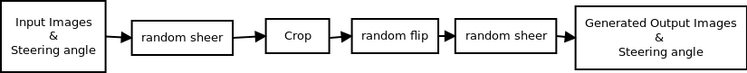
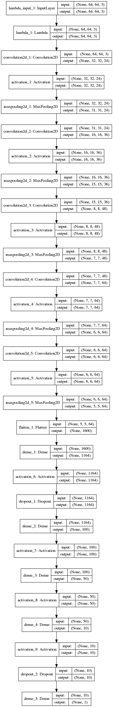
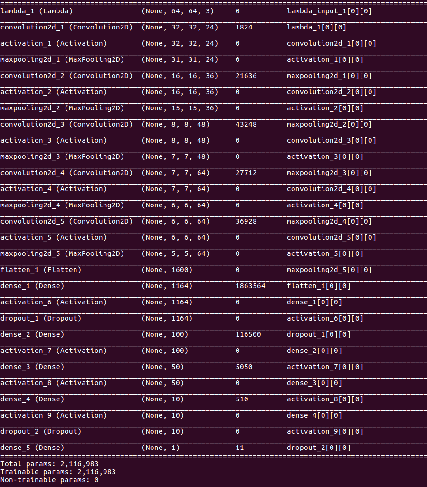

#**Behavioral Cloning** 

**Behavrioal Cloning Project**

The objective of this project is to clone human driving behavior using a Deep Neural Network. 
In order to achieve this, I did use here a simple Car Simulator provided by udacity. During the training phase, I did navigate our car inside the simulator using the keyboard and using simulator i recorded training image and steering angles.
The idea behind that is to use the recorded training data  to train neural network as developed in model.py.
But i did notice that my recorded data was not perfect and in the end i used udacity provided data. I divided the given data into training data and validation data.
Trained model was tested on two tracks, namely training track and validation track. Following two animations show the performance of our final model in both training and validation tracks.

**Dependencies**

This project requires **Python 3.5** and the following Python libraries installed:

- [NumPy](http://www.numpy.org/)
- [SciPy](https://www.scipy.org/)
- [matplotlib](http://matplotlib.org/)
- [pandas](http://pandas.pydata.org/)
- [TensorFlow](http://tensorflow.org)
- [Keras](https://keras.io/)
- [h5py](http://www.h5py.org/)

Only needed for driving in the simulator:

- [flask-socketio](https://flask-socketio.readthedocs.io/en/latest/)
- [eventlet](http://eventlet.net/)
- [pillow](https://python-pillow.org/)

[//]: # (Image References)

[image1]: ./examples/placeholder.png "Model Visualization"
[image2]: ./examples/placeholder.png "Grayscaling"
[image3]: ./examples/placeholder_small.png "Recovery Image"
[image4]: ./examples/placeholder_small.png "Recovery Image"
[image5]: ./examples/placeholder_small.png "Recovery Image"
[image6]: ./examples/placeholder_small.png "Normal Image"
[image7]: ./examples/placeholder_small.png "Flipped Image"


####1. Submission includes all required files and can be used to run the simulator in autonomous mode

My project includes the following files, the code is usable and readable

* model.py containing the script to create and train the model
* drive.py for driving the car in autonomous mode
* model.h5 containing a trained convolution neural network
* utils.py containing the data processing utilities required in training the model and as well used in the autonomous mode to drive the vehilce (used by drive.py)
* ReadME.md  summarizing the results

####2. Submssion includes functional code
Using the Udacity provided simulator and my drive.py file, the car can be driven autonomously around the track by executing 
```sh
python drive.py model.h5
```

####3.Dataset Statistics

The dataset consists of 24108 images (8036 images per camera angle). The training track contains a lot of shallow turns and straight road segments. 
Hence, the majority of the recorded steering angles are zeros. Therefore, preprocessing images and respective steering angles are necessary
in order to generalize the training model for unseen tracks such as my validation track.

Below is the data processing pipeline.
<p align="center">
 
</p>


In the very first state of the pipeline, we apply random shear operation. However, we select images with 0.9 probability for the random shearing process. We kept 10 percent of original images and steering angles in order to help the car to navigate in the training track. The following figure shows the result of shearing operation applied to a sample image.
The images captured by the simulator come with a lot of details which do not directly help model building process.  In addition to that extra space occupied by these details required additional processing power. Hence, we remove 35 percent of the original image from the top and 10 percent. This process was done in crop stage. The following figure shows the result of cropping operation applied to an image.
The next stage of the data processing pipeline is called random flip stage. In this stage we randomly (with 0.5 probability) flip images. The idea behind this operation is left turning bends are more prevalent than right bends in the training track. Hence, in order to increase the generalization of our mode, we flip images and respective steering angles. The following figure shows the result of flipping operation applied to an image.

In the final state of the pipeline, we resize images to 64x64 in order to reduce training time.

Next we are going to discuss our neural network architecture.

###Model Architecture and Training Strategy

####1. An appropriate model arcthiecture has been employed

convolutional neural network architecture was inspired by NVIDIA's End to End Learning for Self-Driving Cars paper.
The main difference between our model and the NVIDIA mode is than we did use MaxPooling layers just after each  Convolutional Layer in order to cut down training time. 
For more details about our network architecture please refer following figure.

<p align="center">
 
</p>

___________________________________________________________________________________________________

####2. Attempts to reduce overfitting in the model

The model contains dropout layers in order to reduce overfitting 

To make the architecture more robust and to prevent overfitting
The model was trained and validated on different data sets to ensure that the model was not overfitting. 
The model was tested by running it through the simulator and ensuring that the vehicle could stay on the track.

Dropout disables neurons in your network by a given probability and prevents co-adaption of features.

####3. Model parameter tuning

The model used an adam optimizer, so the learning rate was not tuned manually.

####4. Appropriate training data

Training data was chosen to keep the vehicle driving on the road. I used a combination of center lane driving, recovering from the left and right sides of the road ... 

For details about how I created the training data, see the next section. 

###Model Architecture and Training Strategy

####1. Solution Design Approach
Even after cropping and resizing training images (with all augmented images), training dataset was very large and it could not fit into the main memory. Hence, we used `fit_generator` API of the Keras library for training our model.

We created two generators namely:

* `train_gen = utils.generate_next_batch()`
* `validation_gen = utils.generate_next_batch()` 

Batch size of both `train_gen` and `validation_gen` was 64. We used 20032 images per training epoch.
It is to be noted that these images are generated on the fly using the document processing pipeline described above.
In addition to that, we used 6400 images (also generated on the fly) for validation. We used `Adam` optimizer with `1e-4` learning rate. 
Finally, when it comes to the number of training epochs we tried several possibilities such as `5`, `8`, `1`0, `2`5 and `50`. However, `12` works well on both training and validation tracks.

####2. Model Architecture
I looked into NVIDIA's CNN - Paper: https://arxiv.org/pdf/1604.07316v1.pdf.
Before finalizing on this architecture, I experimented with a model from the Keras lab(transfer learning using inception V3), 
and Comma.ai's model from: https://github.com/commaai/research. The problem with both of these models is that they 
have too many model parameters and the hidden layers weights are much too large to be scalable. I chose the NVIDIA 
based model weights are a lot smaller; and therefore, much more scalable and performs faster. 
I pretty much followed the CNN network architecture from NVIDIA as outlined in their paper.

####2.1 Normalization

I use a Keras lambda function to normalize the data between -1 to 1. 
Putting normalization in Keras allows the operation to be parallelized in GPUs and I don’t have to normalize manually 
when running the model during testing in the simulator in autonomous mode

####2.2 Feature Extraction

There are 4 ConvNet layers. Each has:

2D Convolution
ELU activation function
Max Pooling

For the first three 2D Convolutions, I first did 5x5 to extract large features. Then the later two convolutions, we do 3x3 to extract groupings of features.

For the activation I use ELU instead of RELU, which was talked about in the lectures. With RELU some neurons can become inactive because the negative half of the RELU sends them to 0. ELU uses both positive and negative values and can train systems more consistently: http://www.picalike.com/blog/2015/11/28/relu-was-yesterday-tomorrow-comes-elu/

We use max pooling to bring down the dimensionality of the training and yield less data.


####2.3 Decision Making

First the data is flattened. Then 4 hidden layers are used, of sizes 1164, 100, 50, and 10 neurons.
Each of these has a ELU activation function. Lastly, there is 1 output neuron.

I used dropout to prevent overfitting to the specific images that the system is trained on.


####3. Final Model Architecture

The final model architecture consisted of a convolution neural network with the following layers and layer sizes  
<p align="center">
 
</p>

## Results
In the initial stage of the project, I used a dataset generated by myself. 
That dataset was small and recorded while navigating the car using the laptop keyboard. 
However, the model built using that dataset was not good enough to autonomously navigate the car in the simulator. 
However, later I used the dataset published by the Udacity. The model developed using that dataset (with the help of augmented data) works well on both tracks as shown in following videos. 

Training | Validation
------------|---------------
 | 


## Conclusions and Future Directions
In this project, we were working on a regression problem in the context of self-driving cars.
In the initial phase, we mainly focused on finding a suitable network architecture and trained a model using our own dataset.
However, it didn't perform as expected when we test the model using the simulator. 

Then I started to use a new dataset (actually, it was the dataset published by Udacity). 
 Also, I used relatively small number of training epochs. Data augmentation and new dataset work  well and our final model showed ok performance on both tracks. 

When it comes to extensions and future directions, Idid try the following.

* Use Transfer learning approach for the same project. I did try to use inception V3 to do the same. But i couldnt get proper results. 
May be i need to do exercise on proper  possible data augmentation techniques and data handling. This i am planning to do as my own exercise. 


